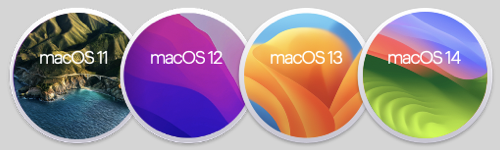

# GPD P2 Max 2019 Hackintosh

Hackintosh EFI folder for **GPD P2 Max 2019** (m3-8100Y BIOS 0.29) now supports up to **macOS 14 Sonoma**: 
  
With OCAuxiliaryTools I updated https://github.com/Azkali/GPD-P2-MAX-Hackintosh/tree/OpenCore (Jan 13,2021) to the latest **OpenCore 0.9.7**.  Added some Kexts and selected SMBIOS **MacBookAir8,2** (maximum macOS = Current).   

## Basic Usage
1. Create a macOS Sonoma bootable USB using this [tutorial](https://dortania.github.io/OpenCore-Install-Guide/installer-guide/) but use the provided EFI folder instead of configuring it on your own
2. Boot from the freshly created USB then install macOS Sonoma on a free partition of your drive
3. During first boot, after installing the OS, mount your EFI partition and place the EFI folder content alongside other OSes bootloader
4. Reboot and change BIOS bootloader order to have OpenCore bootloader as first entry
5. Generate a new SMBIOS using CorpNewt's [GenSMBIOS](https://github.com/corpnewt/GenSMBIOS)
6. Reboot and enjoy !

## What’s included
........................................................... release .... comment .................................................... MinKernel .. MaxKernel  
• Lilu.kext ............................................ 1.6.7  
• VirtualSMC.kext ................................ 1.3.2  
• AppleALC.kext .................................. 1.8.8  
• IntelBTPatcher.kext (1) ..................... 2.3.0 _...... for macOS 12 Monterey and newer only ...... 21.0.0_  
• IntelBluetoothFirmware.kext (1) ....... 2.3.0  
• IntelBluetoothInjector.kext (1) .......... 2.3.0 _...... for macOS 11 BigSur and earlier only ........................... 20.99.99_  
• BlueToolFixup.kext (1) ...................... 2.6.8 _...... for macOS 12 Monterey and newer only ...... 21.0.0_  
• SMCProcessor.kext .......................... 1.3.2  
• SMCBatteryManager.kext ................ 1.3.2  
• WhateverGreen.kext ........................ 1.6.6  
• CPUFriend.kext ................................ 1.2.7  
• NVMeFix.kext ................................... 1.1.1  
• USBPorts.kext .................................. 1.0  
• NullEthernet.kext ............................. 1.0.6  
• NightShiftUnlocker.kext ................... 2.2.1  
• BrightnessKeys.kext (3) ................... 1.0.3  
• VoodooI2CGoodix.kext .................... 0.3.1  
• VoodooI2C.kext ................................ 2.8  
• SystemProfilerMemoryFixup.kext .... 1.0.0  
• RTCMemoryFixup.kext ..................... 1.0.7  
• AirportItlwm-BigSur.kext (2) ............ 2.2.0 _...... for macOS 11 BigSur only ............................. 20.0.0 .... 20.99.99_  
• AirportItlwm-Monterey.kext (2) ....... 2.2.0 _...... for macOS 12 Monterey only ........................ 21.0.0 .... 21.99.99_  
• AirportItlwm-Ventura.kext (2) .......... 2.2.0 _...... for macOS 13 Ventura only .......................... 22.0.0 .... 22.99.99_  
• AirportItlwm-Sonoma.kext (2) ......... 2.3.0 _...... for macOS 14 Sonoma only .......................... 23.0.0 .... 23.99.99_  

## What works
• Audio  
• Battery Status  
• Bluetooth (1)  
• Camera  
• Graphics Resolution: _**1280x800 (HiDPI)** and 2560x1600 (native)_  
• Keyboard  
• Sleep / Wake  
• TouchPad  
• USB and USB Mapping  
• internal  Wi-Fi (Intel AC7625) (2)  
• external LAN (Realtek RTL8156B): _Cable Matters **USB-C to 2.5GbE Adapter** with PD  (Plug&Play, Driver-Free)_  

## What doesn't work
• Brightness control (3)  
• Fingerprint Sensor  
• Graphics Acceleration  
• Power Management  
• TouchScreen  

## Enable HiDPI mode
You can enable HiDPI mode which adds _**1280x800**_ to the list of available display resolution options.  
Enter the following command in terminal post-installation, then reboot:  
_sudo defaults write /Library/Preferences/com.apple.windowserver.plist DisplayResolutionEnabled -bool true_ 
_________________________________________________________________________________________________
(1) https://openintelwireless.github.io/IntelBluetoothFirmware/FAQ.html#what-additional-steps-should-i-do-to-make-bluetooth-work-on-macos-monterey-and-newer   
(2) https://github.com/OpenIntelWireless/itlwm   
(3) https://github.com/acidanthera/BrightnessKeys   
