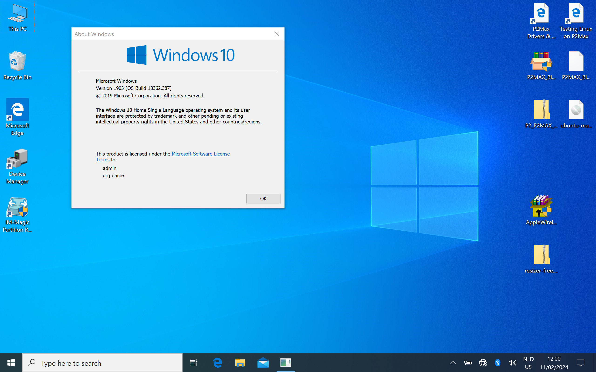
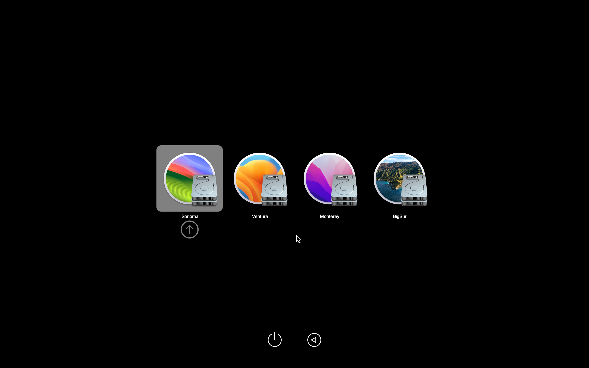
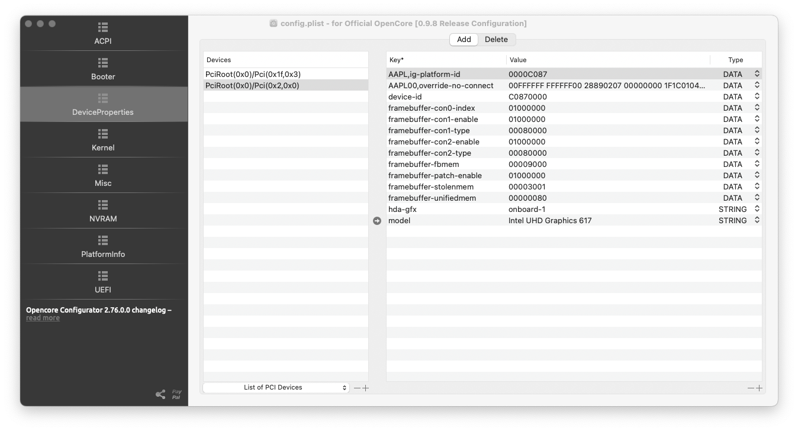
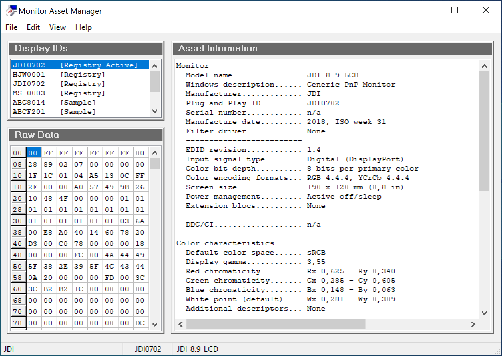

# GPD P2 Max 2019 Hackintosh

OpenCore EFI folder for **GPD P2 Max 2019** (m3-8100Y BIOS 0.29) now supports up to **macOS 14.4 Sonoma**  

With **OCAuxiliaryTools** I updated repository [_Azkali/GPD-P2-MAX-Hackintosh (Jan 13, 2021)_](https://github.com/Azkali/GPD-P2-MAX-Hackintosh/tree/OpenCore) to **OpenCore 0.9.9**  
Added some Kexts and selected SMBIOS **MacBookAir8,2** (maximum OS = Current)   

   
   
   

## Basic Usage
1. Create a macOS Sonoma bootable USB using this [_tutorial_](https://dortania.github.io/OpenCore-Install-Guide/installer-guide/) but use the provided EFI folder instead of configuring it on your own
2. Boot from the freshly created USB then install macOS Sonoma on a free partition of your drive
3. During first boot, after installing the OS, mount your EFI partition and place the EFI folder content alongside other OSes bootloader
4. Reboot and change BIOS bootloader order to have OpenCore bootloader as first entry
5. Generate a new SMBIOS using CorpNewt's [_GenSMBIOS_](https://github.com/corpnewt/GenSMBIOS)
6. Reboot and enjoy !

## What’s included
............................................................. release ........ comment ......................... MinKernel ... MaxKernel  
• Lilu.kext ............................................ 1.6.7  
• VirtualSMC.kext ............................... 1.3.2  
• AppleALC.kext ................................. 1.8.9  
• IntelBTPatcher.kext_1_ ........................ 2.4.0 _............. for macOS 12 and newer ...... 21.0.0_  
• IntelBluetoothFirmware.kext_1_ .......... 2.4.0  
• IntelBluetoothInjector.kext_1_ ............. 2.4.0 _............. for macOS 11 and earlier ...................... 20.99.99_  
• BlueToolFixup.kext_1_ .......................... 2.6.8 _............ for macOS 12 and newer ...... 21.0.0_  
• SMCProcessor.kext .......................... 1.3.2  
• SMCBatteryManager.kext ................ 1.3.2  
• WhateverGreen.kext ........................ 1.6.6  
• CPUFriend.kext ................................ 1.2.7  
• NVMeFix.kext ................................... 1.1.1  
• USBPorts.kext .................................. 1.0  
• NullEthernet.kext ............................. 1.0.6  
• ~~NightShiftUnlocker.kext_3_ ................. 2.2.1 _............. superseded by FeatureUnlock_~~  
• FeatureUnlock.kext_3_ ........................ 1.1.5  
• BrightnessKeys.kext ........................ 1.0.3  
• VoodooI2CGoodix.kext .................... 0.4.0  
• VoodooI2C.kext ................................ 2.8  
• SystemProfilerMemoryFixup.kext .... 1.0.0  
• RTCMemoryFixup.kext ..................... 1.0.7  
• AirportItlwm-BigSur.kext_2_ ................ 2.2.0 _............ for macOS 11 only ................ 20.0.0 .... 20.99.99_  
• AirportItlwm-Monterey.kext_2_ ........... 2.2.0 _............ for macOS 12 only ................ 21.0.0 ..... 21.99.99_  
• AirportItlwm-Ventura.kext_2_ .............. 2.2.0 _............ for macOS 13 only ................ 22.0.0 .... 22.99.99_  
• AirportItlwm-Sonoma.kext_2_ ............. 2.3.0_alpha_ _..... for macOS 14 only ................ 23.0.0 .... 23.99.99_  

## What works
• Audio  
• Battery Status  
• Bluetooth_1_  
• Brightness control   
• Camera  
• Graphics Acceleration  
• Graphics Resolution: _default **1280x800 (HiDPI)** and 2560x1600 (native)_  
• Keyboard  
• Power Management  
• Sleep / Wake  
• TouchPad  
• USB and USB Mapping  
• Volume control   
• internal Wi-Fi AC (Intel 7265D2W)_2_  
• external LAN (Realtek 8156B): _Cable Matters **USB-C to 2.5GbE Adapter** with PD  (Plug&Play, Driver-Free)_  

## What doesn't work
• Fingerprint Sensor  
• TouchScreen  

## Notes
• Fixing the iGPU hardware acceleration  
    
• Grabbing the built-in screen's EDID data for AAPL00_4_  

...   

## Credits
Special thanks go to [**@muhamadahmadbzu**](https://github.com/muhamadahmadbzu), who kindly shared his solution for the iGPU hardware acceleration_4_  
Thanks to [**@Azkali**](https://github.com/Azkali), whose initial **[WIP] OpenCore EFI repository** became the reference for this project  
[OpenCore Auxiliary Tools (OCAT)](https://github.com/ic005k/OCAuxiliaryTools)  
[Dortania OpenCore Install Guide](https://dortania.github.io/OpenCore-Install-Guide/config-laptop.plist/kaby-lake.html#laptop-kaby-lake-amber-lake-y)  
[**GPD** for creating the world's smallest Ultrabook **P2 Max 2019**](https://web.archive.org/web/20190926230736/https://www.gpd.hk/gpdp2max)  

_________________________________________________________________________________________________
_1 https://openintelwireless.github.io/IntelBluetoothFirmware/FAQ.html#what-additional-steps-should-i-do-to-make-bluetooth-work-on-macos-monterey-and-newer_  
_2 https://github.com/OpenIntelWireless/itlwm/releases_  
_3 https://github.com/acidanthera/Lilu/blob/master/KnownPlugins.md_   
_4 https://osxlatitude.com/forums/topic/18095-how-do-i-grab-my-screens-edid-information/_
