

# GPD P2 Max 2019 Hackintosh  

This EFI folder for **8.9" GPD P2 Max 2019** (m3-8100Y, BIOS V0.29) supports up to **macOS 26.4.1 Tahoe**  

With **OCAuxiliaryTools** I updated [_Azkali/GPD-P2-MAX-Hackintosh (Jan 13, 2021)_](https://github.com/Azkali/GPD-P2-MAX-Hackintosh/tree/OpenCore) to **OpenCore 1.0.7**  
Added some Kexts and selected SMBIOS **MacBookPro16,2** (maximum macOS = Tahoe)  

_**BREAKING NEWS**  
• Jessie's Flying Benchmark videos: [Did macOS Tahoe kill official OCLP 3.0 support? Most likely...](https://www.youtube.com/watch?v=MBnKT_ga3Ss&list=PLHL6IcL-qTheCdZSWluPmSfSg6FbqVnGj&index=1)  
• From Aqua and Aero to Liquid Glass: [why Apple is returning to the "glass" interface](https://mezha.media/en/articles/vid-aqua-ta-aero-do-liquid-glass-chomu-apple-povertayetsya-do-sklyanogo-interfeysu-302604/)_  

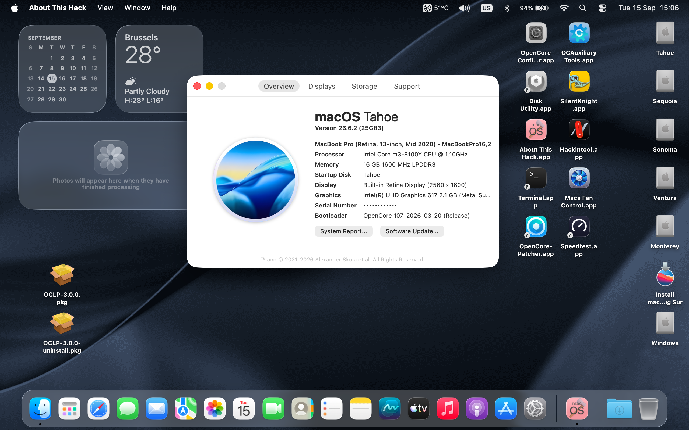 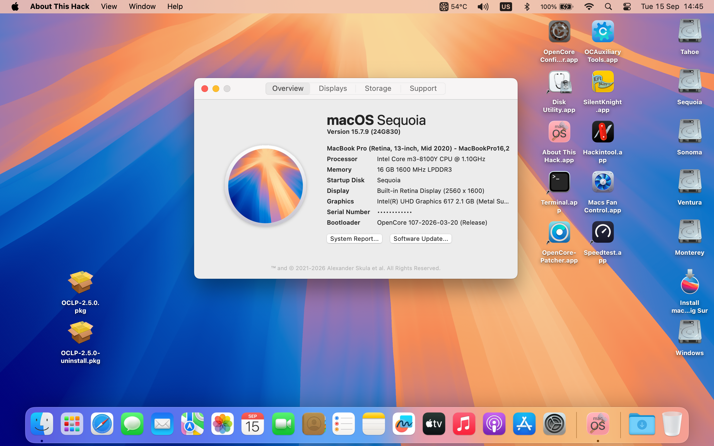  
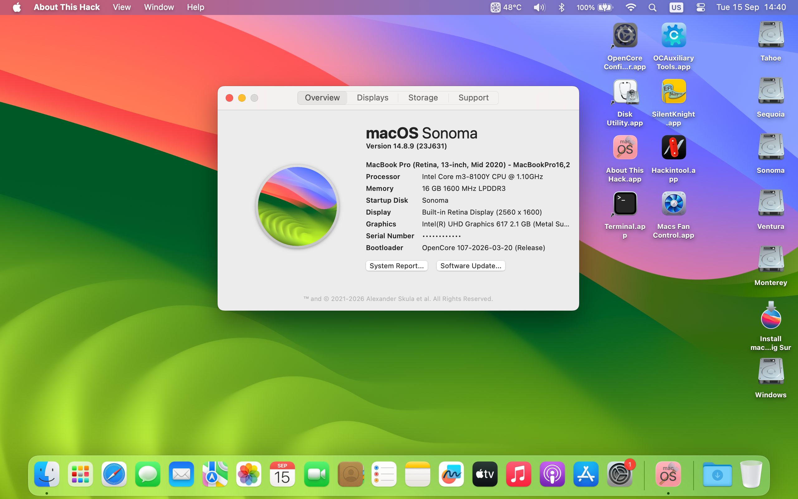 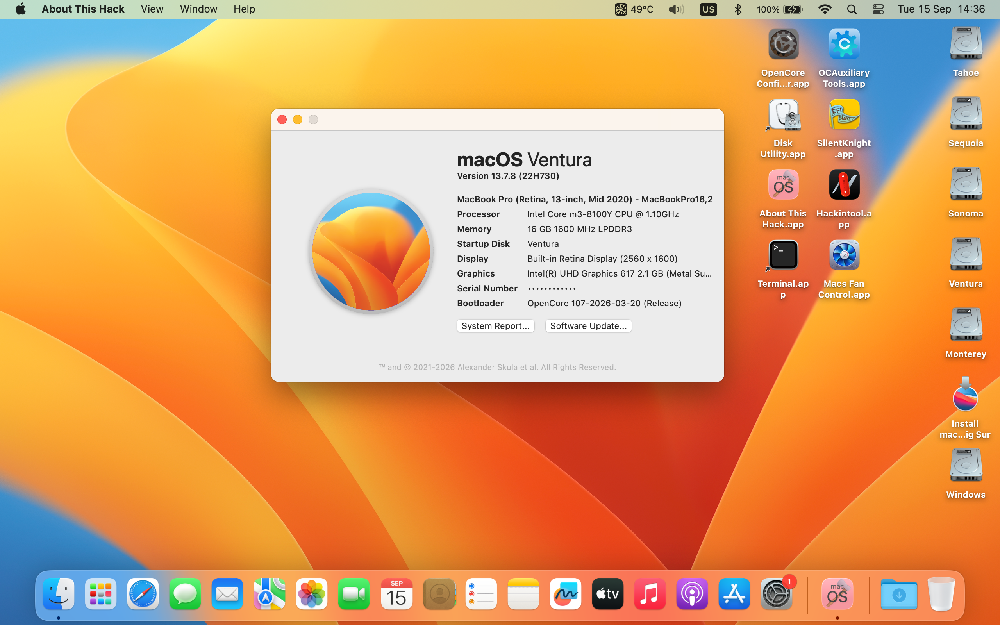  
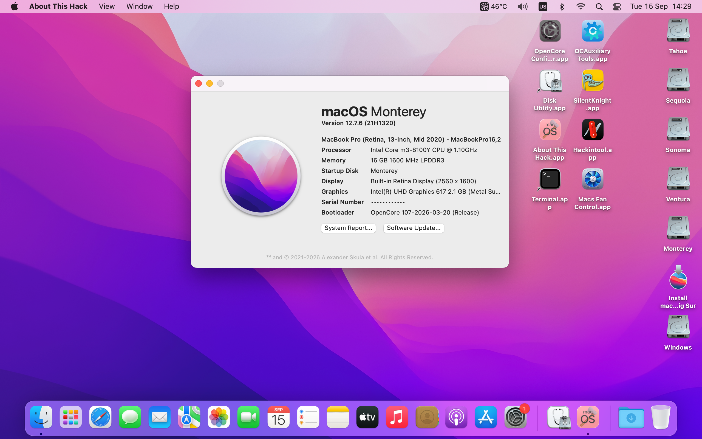 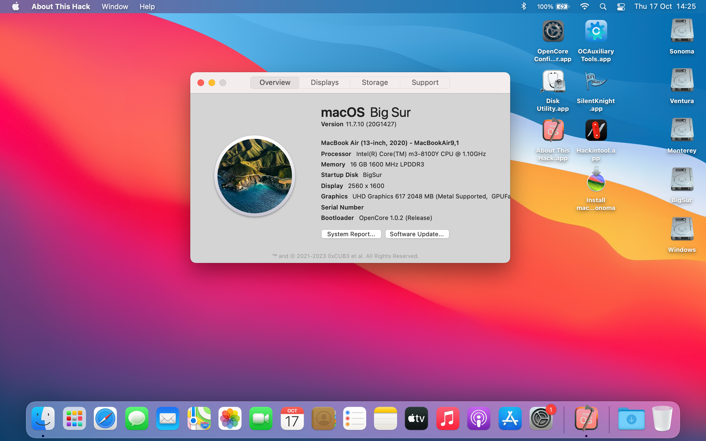  
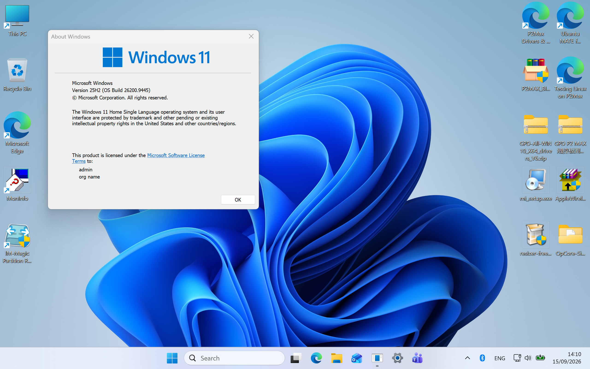  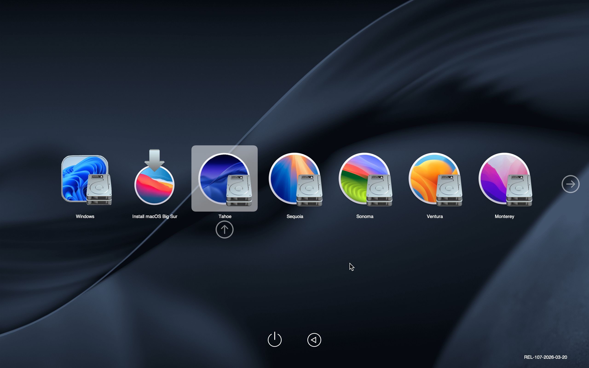  

## Hardware specs  
• CPU: Intel Core m3-8100Y (8th-gen Amber Lake-Y)  
• GPU: Intel UHD Graphics 615  
• RAM: 16GB LPDDR3 1866MHz  
• SSD: 512GB PCIe NVMe M.2 2280 (BiWIN NS200)  
• Laptop Make and Model: GPD P2 Max 2019  
• Audio Codec: Realtek ALC269  
• Ethernet USB-C Adapter:  Realtek RTL8156B  
• Wifi/BT Card:  Intel AC 7265D2W  
• Touchpad:  I²C HID Device  
• BIOS Revision: AMI 5.12, GPD P2 Max 0.29  

## Basic Usage  
1. Create a macOS Tahoe bootable USB using this [_tutorial_](https://dortania.github.io/OpenCore-Install-Guide/installer-guide/) but use the provided EFI folder instead of configuring it on your own  
2. Boot from the freshly created USB then install macOS Tahoe on a free partition of your drive  
3. During first boot, after installing the OS, mount your EFI partition and place the EFI folder content alongside other OSes bootloader  
4. Reboot and change BIOS bootloader order to have OpenCore bootloader as first entry  
5. Generate a new SMBIOS using CorpNewt's [_GenSMBIOS_](https://github.com/corpnewt/GenSMBIOS)  
6. Reboot and enjoy !  

## What’s included  
........................................................... release ............ comment ....................... MinKernel .... MaxKernel  
• Lilu.kext ........................................... 1.7.2  
• VirtualSMC.kext .............................. 1.3.7  
• WhateverGreen.kext ....................... 1.7.0  
• AppleALC.kext ................................ 1.9.7  
• RestrictEvents.kext ......................... 1.1.6  
• BrightnessKeys.kext ....................... 1.0.3  
• ECEnabler.kext ................................ 1.0.6  
• FeatureUnlock.kext_3_ ....................... 1.1.8  
• HibernationFixup.kext ..................... 1.5.4  
• ~IntelBTPatcher.kext_1_ ........................ 2.4.0 _............... now handled by IntelBluetoothFirmware_~  
• IntelBluetoothFirmware.kext_1_ .......... 2.4.0  
• IntelBluetoothInjector.kext_1_ ............. 2.4.0 _............... for macOS 11 or earlier ....................... 20.9.9_  
• BlueToolFixup.kext_1_ ......................... 2.7.2 _................ for macOS 12 or later ........... 21.0.0_  
• NVMeFix.kext .................................. 1.1.3  
• SMCBatteryManager.kext ............... 1.3.7  
• SMCProcessor.kext ......................... 1.3.7  
• SMCSuperIO.kext ............................ 1.3.7  
• USBPorts.kext ................................. 1.0  
• VoodooI2C.kext ............................... 2.9.1  
• VoodooI2CGoodix.kext ................... 0.4.0  
• VoodooI2CHID.kext ......................... 1  
• VoodooPS2Controller.kext .............. 2.3.7  
• Itlwm.kext_5_ ...................................... 2.3.0_stable_ _........ for macOS 15 or later .......... 24.0.0 .... 25.9.9_  
• IOSkywalkFamily.kext_5_ .................... 1.0 _................... for macOS 15 only ............... 24.0.0 .... 24.9.9_  
• IO80211FamilyLegacy.kext_5_ ............ 1200.12.2b1 _.... for macOS 15 only ............... 24.0.0 .... 24.9.9_  
• AMFIPass.kext_5_ ............................... 1.4.1 _................ for macOS 12 or later ........... 21.0.0_  
• AirportItlwm-Sequoia.kext_5_ ............ 2.3.0_patch_ _........ for macOS 15 only ............... 24.0.0 .... 24.9.9_  
• AirportItlwm-Sonoma14.4.kext_2_ ..... 2.3.0_stable_ _........ for macOS 14.4 or later ....... 23.4.0 .... 23.9.9_  
• AirportItlwm-Sonoma14.0.kext_2_ ..... 2.3.0_stable_ _........ for macOS 14.3 or earlier .... 23.0.0 .... 23.3.9_  
• AirportItlwm-Ventura.kext_2_ ............. 2.3.0_stable_ _....... for macOS 13 only ............... 22.0.0 .... 22.9.9_  
• AirportItlwm-Monterey.kext_2_ .......... 2.3.0_stable_ _....... for macOS 12 only ................ 21.0.0 .... 21.9.9_  
• AirportItlwm-BigSur.kext_2_ ............... 2.3.0_stable_ _....... for macOS 11 only ................ 20.0.0 .... 20.9.9_  

## What works  
• Audio  
• Battery Status  
• Bluetooth_1_  
• Brightness control   
• Camera  
• Graphics Acceleration  
• Graphics Resolution : _default **1280x800 (HiDPI)** and 2560x1600 (native)_  
• Keyboard  
• Power Management  
• Sleep / Wake  
• TouchPad  
• USB and USB Mapping  
• Volume control  
• internal Wi-Fi AC (Intel 7265D2W)_2_  
• external LAN (Realtek RTL8156B) : _Cable Matters **USB-C to 2.5GbE Adapter** with PD  (Plug&Play, Driver-Free)_  

## What doesn't work  
• Fingerprint Sensor  
• TouchScreen  
• **HDMI video/audio output** no longer works6 

## How to build this dual boot Hackintosh from scratch:  
_**⚠️ Disclaimer:  Back up your data first! Installing GPD firmware will always erase the entire 512GB drive!**_  

_1. The latest [_GPD P2Max Windows10 Home v1909 firmware_](https://gpd.hk/gpdp2maxfirmwaredriverbios)7 restores the factory Out-Of-Box-Experience:_  
 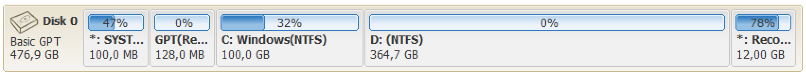  

_2. Delete partitions GPT(128MB), D:(365GB NTFS) and Recovery(12GB NTFS) with IM-Magic Partition Resizer._  
   
_Move SYSTEM(100MB FAT32) and resize C:Windows(238GB NTFS) to the end of local Disk0._  
 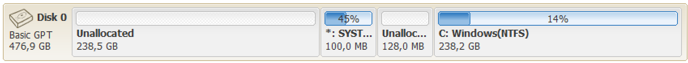  

_3. Insert the macOS Tahoe USB installer. Press 'Reload disks' in IM-Magic Partition Resizer.  
Copy bootable EFI(200MB FAT32) of USB Disk1 to Unallocated(238GB) at the begin of local Disk0.  
Format remaining Unallocated(238GB) into partition D:macOS(238GB FAT32) and reboot USB installer._  
 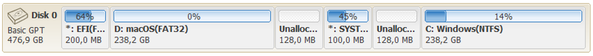  

_4. Erase partition macOS(238GB FAT32) into volume macOS(238GB APFS) in Disk Utility.  
Install macOS Tahoe and copy Hackintosh EFI folder to bootable EFI(200MB FAT32) of local Disk0 and reboot._  
 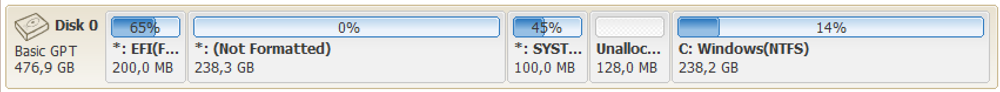  

_5. Download OCLP and apply Root Patches for native Intel WiFi on MacOS Sequoia only. Reboot again._  
 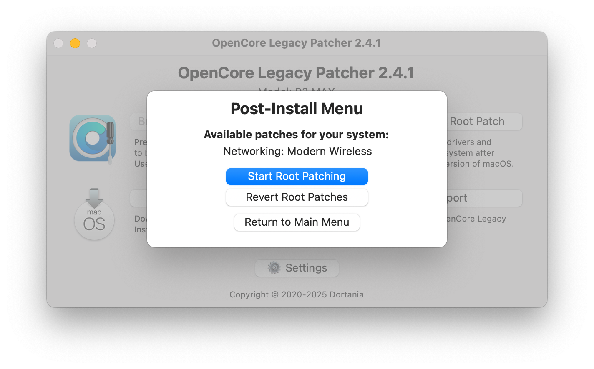  

## Notes
• Fixing the iGPU hardware acceleration  
 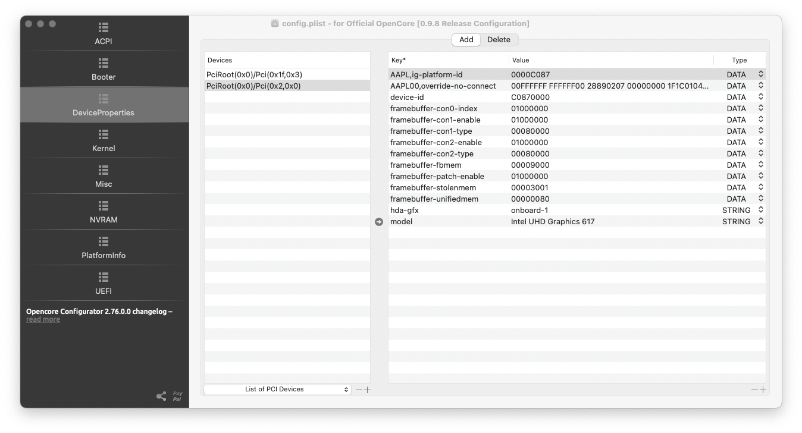  
• Grabbing the built-in screen's EDID data for AAPL00_4_  
... 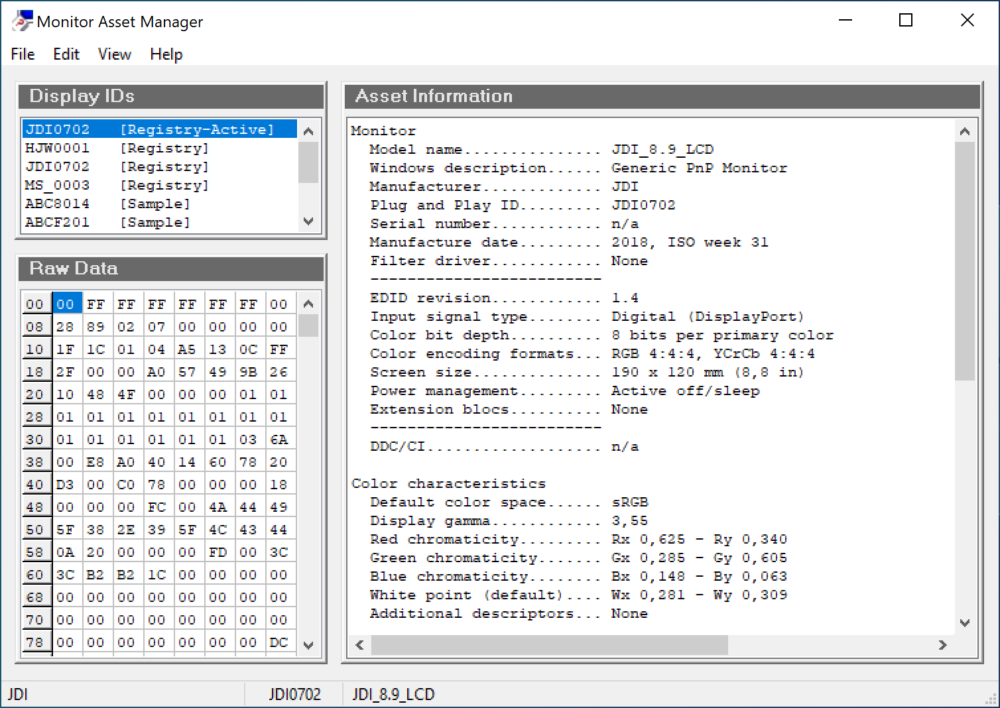  

## Credits  
Special thanks go to [**@muhamadahmadbzu**](https://github.com/muhamadahmadbzu), who kindly shared his solution for the iGPU hardware acceleration_4_  
Thanks to [**@Azkali**](https://github.com/Azkali), whose initial **_[WIP] OpenCore EFI repository_** became the reference for this project  
[OpenCore Auxiliary Tools (OCAT)](https://github.com/ic005k/OCAuxiliaryTools)  
[Dortania OpenCore Install Guide](https://dortania.github.io/OpenCore-Install-Guide/config-laptop.plist/kaby-lake.html#laptop-kaby-lake-amber-lake-y)  
[**GPD** for creating the world's smallest Ultrabook **P2 Max 2019**](https://web.archive.org/web/20190926230736/https://www.gpd.hk/gpdp2max)  

_________________________________________________________________________________________________
_1 https://openintelwireless.github.io/IntelBluetoothFirmware/FAQ.html#what-additional-steps-should-i-do-to-make-bluetooth-work-on-macos-monterey-and-newer_  
_2 https://github.com/OpenIntelWireless/itlwm/releases_  
_3 https://github.com/acidanthera/Lilu/blob/master/KnownPlugins.md_  
_4 https://osxlatitude.com/forums/topic/18095-how-do-i-grab-my-screens-edid-information/_  

_**[SOLVED] Native Intel WiFi and Bluetooth on macOS Sequoia or Tahoe | Step By Step Video-Guide.**_  
_5 https://www.youtube.com/watch?v=kNXrugg25u0_  
_5 https://github.com/randomappleboi/Native-Wifi-for-Hackintoshes-with-Intel-Wireless-cards-on-macOS-sequoia_  

_**[WIP] Have to unplug/replug HDMI cable to connect to external monitor.**_  
_6 https://discussions.apple.com/thread/255088951?sortBy=rank_  

_**[ARCHIVED] GPD P2 MAX Drivers & OS installation Media**_  
_7 https://archive.org/details/gpd-p2-max-drivers-and-os_  

