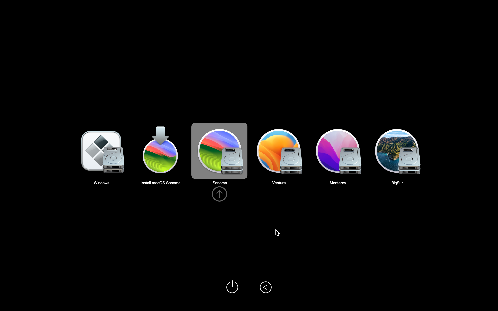

# GPD P2 Max 2019 Hackintosh  [WIP]

OpenCore EFI folder for **GPD P2 Max 2019** (m3-8100Y BIOS 0.29) now supports up to **macOS 15.0.1 Sequoia**  

With **OCAuxiliaryTools** I updated [_Azkali/GPD-P2-MAX-Hackintosh (Jan 13, 2021)_](https://github.com/Azkali/GPD-P2-MAX-Hackintosh/tree/OpenCore) to **OpenCore 1.0.2**  
Added some Kexts and selected SMBIOS **MacBookAir9,1** (maximum OS = Current)  

   
   
   

## Hardware specs  
• CPU: Intel Core m3-8100Y (8th-gen Amber Lake-Y)  
• GPU: Intel UHD Graphics 615  
• RAM: 16GB LPDDR3 1866MHz  
• SSD: 512GB PCIe NVMe M.2 2280 (BiWIN NS200)  
• Laptop Make and Model: GPD P2 Max 2019  
• Audio Codec: Realtek ALC269  
• Ethernet USB-C Adapter:  Realtek RTL8156B  
• Wifi/BT Card:  Intel AC 7265D2W  
• Touchpad:  I²C HID Device  
• BIOS Revision: AMI 5.12, GPD P2 Max 0.29  

## Basic Usage  
1. Create a macOS Sonoma bootable USB using this [_tutorial_](https://dortania.github.io/OpenCore-Install-Guide/installer-guide/) but use the provided EFI folder instead of configuring it on your own  
2. Boot from the freshly created USB then install macOS Sonoma on a free partition of your drive  
3. During first boot, after installing the OS, mount your EFI partition and place the EFI folder content alongside other OSes bootloader  
4. Reboot and change BIOS bootloader order to have OpenCore bootloader as first entry  
5. Generate a new SMBIOS using CorpNewt's [_GenSMBIOS_](https://github.com/corpnewt/GenSMBIOS)  
6. Reboot and enjoy !  

## What’s included  
............................................................. release ........ comment ........................... MinKernel .... MaxKernel  
• Lilu.kext ............................................ 1.6.9  
• VirtualSMC.kext ................................ 1.3.4  
• AppleALC.kext .................................. 1.9.2  
• IntelBTPatcher.kext_1_ ......................... 2.4.0 _........... for macOS 12 and newer ......... 21.0.0 ..... 23.9.9_  
• IntelBluetoothFirmware.kext_1_ ........... 2.4.0 _.............................................................................. 23.9.9_  
• IntelBluetoothInjector.kext_1_ .............. 2.4.0 _........... for macOS 11 and earlier .......................... 20.9.9_  
• BlueToolFixup.kext_1,5_ ........................ 2.6.9 _........... for macOS 12 and newer ......... 21.0.0_  
• BrcmFirmwareData.kext_5_ ................. 2.6.9 _........... for macOS 15 temporarily ....... 24.0.0_  
• BrcmPatchRAM3.kext_5_ ..................... 2.6.9 _........... for macOS 15 temporarily ....... 24.0.0_  
• SMCProcessor.kext .......................... 1.3.4  
• SMCBatteryManager.kext ................ 1.3.4  
• WhateverGreen.kext ........................ 1.6.8  
• CPUFriend.kext ................................ 1.2.9  
• NVMeFix.kext ................................... 1.1.1  
• USBPorts.kext .................................. 1.0  
• NullEthernet.kext ............................. 1.0.6  
• FeatureUnlock.kext_3_ ........................ 1.1.7  
• BrightnessKeys.kext ........................ 1.0.3  
• VoodooI2CGoodix.kext .................... 0.4.0  
• VoodooI2C.kext ................................ 2.8  
• SystemProfilerMemoryFixup.kext .... 1.0.0  
• RTCMemoryFixup.kext ..................... 1.0.7  
• AirportItlwm-BigSur.kext_2_ ................ 2.3.0_stable_ _.... for macOS 11 only .................... 20.0.0 ..... 20.9.9_  
• AirportItlwm-Monterey.kext_2_ ........... 2.3.0_stable_ _.... for macOS 12 only .................... 21.0.0 ..... 21.9.9_  
• AirportItlwm-Ventura.kext_2_ .............. 2.3.0_stable_ _.... for macOS 13 only ................... 22.0.0 ..... 22.9.9_  
• AirportItlwm-Sonoma14.0.kext_2_ ....... 2.3.0_stable_ _... for macOS 14.3.1 and earlier .... 23.0.0 ..... 23.3.9_  
• AirportItlwm-Sonoma14.4.kext_2_ ....... 2.3.0_stable_ _... for macOS 14.4 and newer ...... 23.4.0 ..... 23.9.9_  
• RtWlanU.kext_6_ ............................ 1830.32.b27 _..... for macOS 15 temporarily ....... 24.0.0_  
• RtWlanU1827.kext_6_ ..................... 1827.4.b36 _....... for macOS 15 temporarily ....... 24.0.0_  

## What works  
• Audio  
• Battery Status  
• Bluetooth_1_  
• Brightness control   
• Camera  
• Graphics Acceleration  
• Graphics Resolution : _default **1280x800 (HiDPI)** and 2560x1600 (native)_  
• Keyboard  
• Power Management  
• Sleep / Wake  
• TouchPad  
• USB and USB Mapping  
• Volume control  
• internal Wi-Fi AC (Intel 7265D2W)_2_  
• external LAN (Realtek RTL8156B) : _Cable Matters **USB-C to 2.5GbE Adapter** with PD  (Plug&Play, Driver-Free)_  
• external WLAN (Realtek RTL8811AU)_5_ : _TP-Link **T2U Nano** AC600 Wireless USB Adapter_  
• external BT (Broadcom BCM20702A)_6_ : _Asus **USB-BT400** Bluetooth 4.0 USB Adapter_  

## What doesn't work  
• Fingerprint Sensor  
• TouchScreen  

## _How to build this Hackintosh [WIP]_  
**_Disclaimer: Installing the GPD firmware will erase the entire local drive! Back up your data first!_**  

_The latest [_GPD P2 Max 2019 Windows10 v1909 firmware_](https://gpd.hk/gpdp2maxfirmwaredriverbios) recreates the Windows10 partition (128GB NTFS) and UEFI (100MB NTFS). Resize UEFI (100MB to 1GB) for future Windows11 use with IM-Magic Partition Resizer or an alternative. Then move both Windows10 partitions to the end of local Disk0 and create a main partition (384GB FAT32) at the begin of local Disk0 for macOS use._  

_Copy my Hackintosh EFI folder to the bootable macOS USB installer(s) and reboot. Reformat the main partition (FAT32 to APFS) and install the latest macOS(s) on a separate volume(s) in the main container. Then copy my Hackintosh EFI folder to the EFI partition (200MB FAT32) at the begin of local Disk0 and reboot._  

_The Windows entry in the OpenCore GUI multiboot menu is hidden by default. Rename 'EFI/Microsoft™' folder into 'EFI/Microsoft' to reveal the entry._  

## Notes  
• Upgrade to Windows11 is ready to download and install, but I will stay on Windows10 (EOL Oct 14, 2025) for now.  
  
• Fixing the iGPU hardware acceleration  
   
• Grabbing the built-in screen's EDID data for AAPL00_4_  

...   

## Credits  
Special thanks go to [**@muhamadahmadbzu**](https://github.com/muhamadahmadbzu), who kindly shared his solution for the iGPU hardware acceleration_4_  
Thanks to [**@Azkali**](https://github.com/Azkali), whose initial **_[WIP] OpenCore EFI repository_** became the reference for this project  
[OpenCore Auxiliary Tools (OCAT)](https://github.com/ic005k/OCAuxiliaryTools)  
[Dortania OpenCore Install Guide](https://dortania.github.io/OpenCore-Install-Guide/config-laptop.plist/kaby-lake.html#laptop-kaby-lake-amber-lake-y)  
[**GPD** for creating the world's smallest Ultrabook **P2 Max 2019**](https://web.archive.org/web/20190926230736/https://www.gpd.hk/gpdp2max)  

_________________________________________________________________________________________________
_1 https://openintelwireless.github.io/IntelBluetoothFirmware/FAQ.html#what-additional-steps-should-i-do-to-make-bluetooth-work-on-macos-monterey-and-newer_  
_2 https://github.com/OpenIntelWireless/itlwm/releases_  
_3 https://github.com/acidanthera/Lilu/blob/master/KnownPlugins.md_  
_4 https://osxlatitude.com/forums/topic/18095-how-do-i-grab-my-screens-edid-information/_  

_[WIP] used for macos Sequoia temporarily_  
_5 https://www.tonymacx86.com/threads/sequoia-usb-bluetooth.330275/#post-2411922_  
_6 https://github.com/chris1111/Wireless-USB-OC-Big-Sur-Adapter_  

